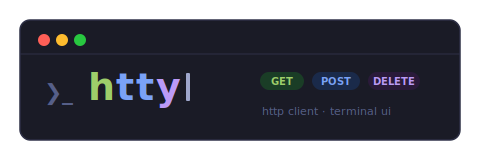

<div align="center">



<br/><br/>

keyboard-driven HTTP client that lives in your terminal.

<br/>


</div>

---

#### Preview:


## Install

```bash
curl -fsSL https://raw.githubusercontent.com/ShubhamTiwary914/htty/master/setup/setup.sh | bash
```

Requires: `curl`, `unzip`, `go`, `make`

---

## Usage

```
htty
```

Navigate panels with `Tab`. Set your method, URL, headers, and body — hit `Enter` to send. Response renders inline.

| Key | Action |
|---|---|
| `Tab` / `Shift+Tab` | Move between panels |
| `Enter` | Confirm / send request |
| `Ctrl+C` | Quit |

---

## Configuration

The install script sets up config at `~/.config/htty/config.json`. Override paths with environment variables:

| Variable | Default | Description |
|---|---|---|
| `CONFIG_FILE` | `~/.config/htty/config.json` | Config file path |
| `CACHE_PREFIX` | `~/.cache/htty` | Completions cache directory |
| `LOGLEVEL` | `info` | Log level (`debug`, `info`, `error`) |
| `LOGFILE` | `/var/log/htty/htty.log` | File for logging I/O |

---

## Build from source

```bash
git clone https://github.com/ShubhamTiwary914/htty
cd htty
make build
```

---

## Contributing

Bug reports and PRs welcome. Open an [issue](https://github.com/ShubhamTiwary914/htty/issues) first for anything beyond small fixes.

---
